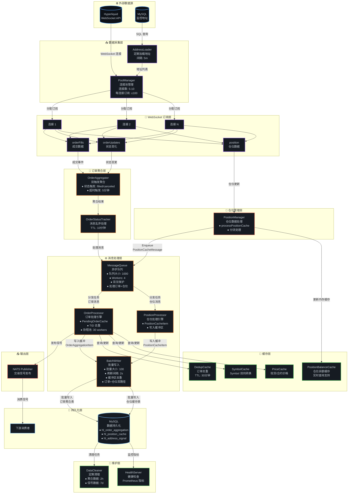
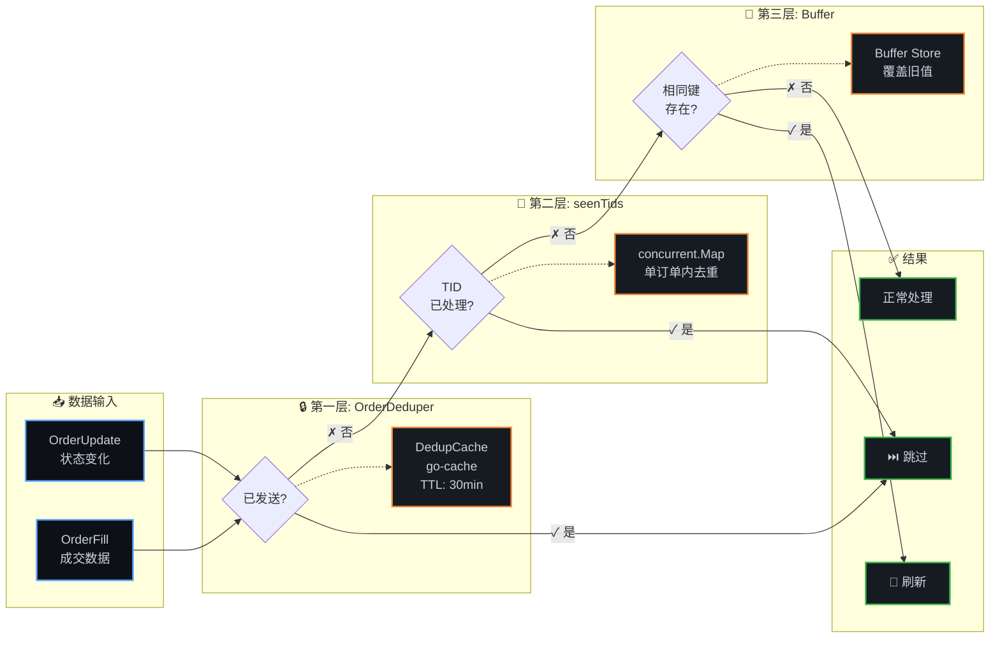

# uTrading HL Monitor

> Hyperliquid 仓位监控服务 - 实时追踪链上大户仓位变化，捕获交易信号

utrading-hl-monitor 通过 WebSocket 连接 Hyperliquid，实时监听指定地址的仓位变化和订单成交事件，并将交易信号发布到 NATS 供下游服务使用。

## ✨ 核心特性

### 实时数据采集
- **WebSocket 双订阅模式** - 同时订阅 orderFills（成交数据）和 orderUpdates（状态变化）
- **多连接负载均衡** - 自动管理多个 WebSocket 连接（5-10 个），支持大规模地址监控
- **智能订阅管理** - 每连接最多 100 个订阅，自动选择负载最少的连接
- **仓位实时追踪** - 订阅现货余额和合约仓位变化

### 信号处理引擎
- **订单成交聚合** - 智能聚合同一订单的多次 fill，计算加权平均价格
- **双触发机制** - 状态触发（filled/canceled）+ 超时触发（5 分钟）
- **反手订单处理** - 自动拆分反手订单为平仓+开仓两个信号
- **平仓比例计算** - 精确计算 CloseRate（平仓数量/持仓数量）
- **消息乱序处理** - OrderStatusTracker 处理先收到状态后收到 fill 的情况
- **订单去重机制** - 服务重启时自动加载已发送订单，防止重复处理

### 性能与可靠性
- **异步消息队列** - 4 个 worker 并发处理，队列满时自动降级为同步处理
- **批量数据库写入** - 缓冲区内去重，批量大小 100 条，刷新间隔 2 秒
- **多层缓存机制** - Symbol 转换、价格数据、订单去重、持仓余额缓存
- **协程池优化** - 使用 ants.Pool 管理并发任务（30 workers）
- **数据清理器** - 定期清理历史数据，防止数据库膨胀

### 可观测性
- **健康检查** - HTTP 端点监控服务状态
- **Prometheus 指标** - 缓存、队列、批量写入、订单聚合等核心指标
- **结构化日志** - 基于 zerolog 的详细日志记录
- **优雅关闭** - 信号处理和资源清理

## 🏗️ 系统架构

### 数据流全景图



**数据流关键修正：**

1. **仓位数据路径更新**：PositionManager 现在通过 MessageQueue 进行异步处理，而不是直接更新缓存
2. **新增 PositionProcessor**：专门处理仓位消息的处理器，将数据写入 BatchWriter
3. **双路径设计**：
   - **写入路径**：WebSocket → PositionManager → MessageQueue → PositionProcessor → BatchWriter → MySQL
   - **缓存路径**：PositionManager → PositionBalanceCache（内存缓存，供实时查询）
4. **BatchWriter 增强**：同时处理订单聚合数据和仓位缓存数据的批量写入

### 组件交互时序图

```mermaid
sequenceDiagram
    participant DB as 🗄️ MySQL<br/>监控地址
    participant PM as 🔌 PoolManager
    participant WS as 📡 WebSocket
    participant OA as 🔄 OrderAggregator
    participant POS as 📍 PositionManager
    participant MQ as 📬 MessageQueue
    participant OP as ⚙️ OrderProcessor
    participant PP as ⚙️ PositionProcessor
    participant BW as 💾 BatchWriter
    participant NATS as 📤 NATS
    participant PBC as 💾 PositionBalanceCache

    rect rgb(13, 17, 23)
        Note over DB,PM: 📅 定期加载监控地址 (每 5 分钟)
        DB->>PM: 1. 查询激活地址列表
        PM->>WS: 2. 分配订阅到最优连接
    end

    rect rgb(22, 27, 34)
        Note over WS,OA: ⚡ 实时数据接收与聚合
        WS->>WS: 接收 orderFills 事件
        WS->>WS: 接收 orderUpdates 事件
        WS->>OA: 3. 转发消息到聚合器
        OA->>OA: 双触发检测<br/>● 状态触发: filled/canceled<br/>● 超时触发: 5 分钟
    end

    rect rgb(13, 17, 23)
        Note over OA,OP: 🔄 订单消息异步处理
        OA->>MQ: 4. 聚合完成，入队
        MQ->>OP: 5. Worker 处理 (4 并发)
        OP->>OP: ● TID 去重检查<br/>● CloseRate 计算<br/>● 构建交易信号
    end

    rect rgb(22, 27, 34)
        Note over WS,POS: 📍 仓位数据接收与分流
        WS->>POS: 6. 仓位变化通知 (WebData2)
        POS->>POS: processPositionCache<br/>解析现货余额和合约仓位
    end

    rect rgb(13, 17, 23)
        Note over POS,BW: 📤 仓位数据双路径处理
        POS->>MQ: 7a. Enqueue PositionCacheMessage
        POS->>PBC: 7b. 更新内存缓存<br/>实时查询支持
        MQ->>PP: 8. Worker 处理仓位消息
        PP->>BW: 9. 加入批量缓冲区<br/>PositionCacheItem
    end

    rect rgb(22, 27, 34)
        Note over OP,NATS: 📤 信号发布与持久化
        OP->>NATS: 10. 发布交易信号
        OP->>BW: 11. 加入批量缓冲区<br/>OrderAggregationItem
        BW->>BW: 缓冲区去重 (覆盖旧值)
        Note over BW: ⏱️ 定时刷新 (100 条 / 2 秒)
        BW->>DB: 12. 批量写入持久化<br/>订单聚合表 + 仓位缓存表
    end
```



### 去重机制架构图



### 核心组件详解

#### WebSocket 层

| 组件 | 文件 | 职责 | 关键特性 |
|------|------|------|----------|
| **PoolManager** | `ws/pool_manager.go` | WebSocket 连接池管理 | • 多连接负载均衡 (5-10 个连接)<br/>• 每连接最多 100 个订阅<br/>• 自动选择负载最少的连接 |
| **ConnectionWrapper** | `ws/connection_wrapper.go` | 单连接封装与重连 | • 指数退避重连 (1s → 30s)<br/>• 最多重试 10 次<br/>• 错误回调机制 |
| **OrderAggregator** | `ws/subscription.go` | 订单聚合与触发 | • 双触发机制 (状态 + 超时)<br/>• 反手订单拆分<br/>• 聚合多次 fill |

#### 订单处理层

| 组件 | 文件 | 职责 | 关键特性 |
|------|------|------|----------|
| **OrderProcessor** | `processor/order_processor.go` | 订单处理核心逻辑 | • PendingOrderCache (O(1) 查询)<br/>• TID 去重机制<br/>• CloseRate 计算<br/>• 协程池 (30 workers) |
| **OrderStatusTracker** | `processor/status_tracker.go` | 消息乱序处理 | • go-cache 实现<br/>• TTL: 10 分钟<br/>• Key 格式: address-oid |
| **MessageQueue** | `processor/message_queue.go` | 异步消息队列 | • 缓冲队列 (1000)<br/>• 4 个 worker 并发<br/>• 背压保护 (队列满时降级) |
| **BatchWriter** | `processor/batch_writer.go` | 批量数据库写入 | • 批量大小: 100 条<br/>• 刷新间隔: 2 秒<br/>• 缓冲区去重 (覆盖旧值) |

#### 缓存层

| 组件 | 文件 | 职责 | 关键特性 |
|------|------|------|----------|
| **DedupCache** | `cache/dedup_cache.go` | 订单去重 | • go-cache 实现<br/>• 范围: address-oid-direction<br/>• TTL: 30 分钟 |
| **SymbolCache** | `cache/symbol_cache.go` | Symbol 双向转换 | • concurrent.Map 实现<br/>• coin ↔ symbol 映射<br/>• 持久化存储 |
| **PriceCache** | `cache/price_cache.go` | 价格数据缓存 | • concurrent.Map 实现<br/>• LRU 淘汰策略<br/>• 现货/合约价格 |
| **PositionBalanceCache** | `cache/position_cache.go` | 仓位余额缓存 | • concurrent.Map 实现<br/>• 实时更新<br/>• CloseRate 计算支持 |

#### 管理层

| 组件 | 文件 | 职责 | 关键特性 |
|------|------|------|----------|
| **Symbol Manager** | `symbol/manager.go` | Symbol 元数据管理 | • 定期从 API 加载 (2 小时)<br/>• 统一管理 Symbol 和价格缓存<br/>• 自动刷新机制 |
| **Position Manager** | `position/manager.go` | 仓位数据管理 | • 订阅仓位变化<br/>• 更新持仓缓存<br/>• 触发信号计算 |

#### 维护层

| 组件 | 文件 | 职责 | 关键特性 |
|------|------|------|----------|
| **Data Cleaner** | `cleaner/cleaner.go` | 定期清理历史数据 | • 聚合数据: 保留 2 小时<br/>• 信号数据: 保留 7 天<br/>• DAO 层批量删除 (1000 条/次) |
| **Health Server** | `monitor/health.go` | 健康检查与指标 | • HTTP 端点监控<br/>• Prometheus 指标暴露<br/>• 服务状态报告 |

### 技术栈

- **语言**：Go 1.23
- **数据库**：MySQL 8.0 + GORM + gorm-gen
- **消息队列**：NATS
- **WebSocket**：自定义实现（基于 gorilla/websocket）
- **缓存**：go-cache, concurrent.Map
- **并发**：sync.Map, ants 协程池
- **监控**：Prometheus
- **日志**：zerolog

## 🚀 快速开始

### 前置要求

- Go 1.23+
- MySQL 8.0+
- NATS Server

### 1. 启动依赖服务

```bash
make docker-up
```

这会启动：
- MySQL (端口 3306)
- NATS (端口 4222)

### 2. 初始化数据库

```bash
mysql -h 127.0.0.1 -u root -p < init.sql
```

### 3. 配置

编辑 `cfg.local.toml`：

```toml
[hl_monitor]
hyperliquid_ws_url = "wss://api.hyperliquid.xyz/ws"
health_server_addr = "0.0.0.0:8080"
address_reload_interval = "5m"
max_connections = 5

[mysql]
dsn = "root:password@tcp(localhost:3306)/utrading?charset=utf8mb4&parseTime=True&loc=Local"

[nats]
endpoint = "nats://localhost:4222"
```

### 4. 添加监控地址

```sql
INSERT INTO hl_watch_addresses (address, label, is_active)
VALUES ('0x1234...', 'Trader A', 1);
```

### 5. 运行

```bash
# 前台运行（调试）
make run

# 后台启动
make start

# 查看日志
make logs
```

### 6. 停止

```bash
make stop
```

## 📊 数据模型

### 核心数据表

#### hl_watch_addresses
监控地址配置表

| 字段 | 类型 | 说明 |
|------|------|------|
| id | uint | 主键 |
| address | string | 链上地址 |
| label | string | 自定义标签 |
| is_active | bool | 是否激活 |

#### hl_position_cache
仓位缓存表

| 字段 | 类型 | 说明 |
|------|------|------|
| id | uint | 主键 |
| address | string | 链上地址 |
| spot_balances | json | 现货余额 JSON |
| spot_total_usd | string | 现货总价值 |
| futures_positions | json | 合约仓位 JSON |
| account_value | string | 账户总价值 |
| updated_at | datetime | 更新时间 |

#### hl_order_aggregation
订单聚合表

| 字段 | 类型 | 说明 |
|------|------|------|
| oid | bigint | 订单 ID（主键） |
| address | string | 监控地址 |
| symbol | string | 交易对 |
| total_size | decimal | 总数量 |
| weighted_avg_px | decimal | 加权平均价 |
| order_status | varchar | 订单状态 |
| last_fill_time | bigint | 最后 fill 时间 |
| signal_sent | boolean | 信号是否已发送 |

#### hl_address_signal
地址信号表

| 字段 | 类型 | 说明 |
|------|------|------|
| id | bigint | 主键 |
| address | varchar | 监控地址 |
| symbol | varchar | 交易对 |
| asset_type | varchar | spot/futures |
| direction | varchar | open/close |
| side | varchar | LONG/SHORT |
| position_size | varchar | Small/Medium/Large |
| size | decimal | 数量 |
| price | decimal | 价格 |
| close_rate | decimal | 平仓比例 |
| created_at | timestamp | 创建时间 |

### 交易信号格式

```go
type HlAddressSignal struct {
    Address      string  // 监控地址
    AssetType    string  // spot/futures
    Symbol       string  // 交易对
    Direction    string  // open/close
    Side         string  // LONG/SHORT
    PositionSize string  // Small/Medium/Large
    Size         float64 // 数量
    Price        float64 // 加权平均价
    CloseRate    float64 // 平仓比例
    Timestamp    int64   // 时间戳
}
```

## 🔧 开发指南

### 项目结构

```
utrading-hl-monitor/
├── cmd/hl_monitor/          # 主程序入口
├── internal/                # 内部包（领域驱动设计）
│   ├── address/            # 地址加载器
│   ├── cache/              # 缓存层
│   │   ├── dedup_cache.go  #   订单去重
│   │   ├── symbol_cache.go #   Symbol 转换
│   │   ├── price_cache.go  #   价格缓存
│   │   └── position_cache.go # 仓位余额
│   ├── cleaner/            # 数据清理器
│   ├── dal/                # 数据库连接
│   ├── dao/                # 数据访问对象层
│   ├── manager/            # Symbol Manager, PoolManager
│   ├── models/             # 数据模型
│   ├── monitor/            # 健康检查
│   ├── nats/               # NATS 发布
│   ├── position/           # 仓位管理
│   ├── processor/          # 消息处理层
│   │   ├── message_queue.go
│   │   ├── batch_writer.go
│   │   ├── order_processor.go
│   │   └── status_tracker.go
│   └── ws/                 # WebSocket 连接
├── pkg/                    # 公共包
│   ├── concurrent/         # 线程安全容器
│   ├── go-hyperliquid/     # Hyperliquid SDK
│   ├── goplus/             # GoPlus API
│   ├── logger/             # 日志包
│   └── sigproc/            # 信号处理
├── docs/plans/             # 设计文档
├── cfg.toml                # 生产配置
├── cfg.local.toml          # 本地配置
├── init.sql                # 数据库初始化
├── Dockerfile              # Docker 镜像
├── docker-compose.yml      # 服务编排
└── Makefile                # 构建命令
```

### 开发命令

```bash
# 构建
make build     # 编译二进制文件
make clean     # 清理构建产物

# 运行
make run       # 前台运行（调试）
make start     # 后台启动
make stop      # 停止服务
make restart   # 重启服务
make logs      # 查看日志

# 测试
make test      # 运行测试
make deps      # 下载依赖

# Docker
make docker-up      # 启动 MySQL 和 NATS
make docker-down    # 停止 Docker 服务
make docker-logs    # 查看 Docker 日志
make docker-ps      # 查看服务状态
```

### DAO 层规范

**重要**：所有数据库操作必须通过 DAO 层，禁止在业务逻辑中直接使用 `dal.MySQL()`。

```go
// ✅ 正确：通过 DAO 访问
dao.Position().UpsertPositionCache(cache)
dao.WatchAddress().ListDistinctAddresses()

// ❌ 错误：直接使用 dal
dal.MySQL().Where(...).First(...)
```

### 添加新数据访问操作

1. 在 `internal/dao/` 对应的 DAO 文件中添加方法
2. 使用 gorm-gen 提供的类型安全查询 API（`gen.Q.*`）
3. 复杂查询可使用 `UnderlyingDB()` 获取底层 GORM 连接

### gorm-gen 代码生成

```bash
cd cmd/gen
go run main.go
```

## ⚙️ 配置说明

### 完整配置项

```toml
[hl_monitor]
hyperliquid_ws_url = "wss://api.hyperliquid.xyz/ws"
health_server_addr = "0.0.0.0:8080"
address_reload_interval = "5m"
max_connections = 5
max_subscriptions_per_connection = 100

[mysql]
dsn = "root:password@tcp(localhost:3306)/utrading?charset=utf8mb4&parseTime=True&loc=Local"
max_idle_connections = 16
max_open_connections = 64
set_conn_max_lifetime = 7200

[nats]
endpoint = "nats://localhost:4222"

[log]
level = "info"
max_size = 50
max_backups = 60
max_age = 15
compress = false
console = false

[order_aggregation]
timeout = "5m"
scan_interval = "30s"
max_retry = 3
retry_delay = "1s"

```

## 📈 监控与运维

### 健康检查端点

| 端点 | 说明 |
|------|------|
| `GET /health` | 健康检查 |
| `GET /health/ready` | 就绪检查 |
| `GET /health/live` | 存活检查 |
| `GET /status` | 服务状态 |
| `GET /metrics` | Prometheus 指标 |

### Prometheus 指标

#### 缓存指标
- `hl_monitor_cache_hit_total{cache_type}` - 缓存命中总数（dedup/symbol/price）
- `hl_monitor_cache_miss_total{cache_type}` - 缓存未命中总数

#### 消息队列指标
- `hl_monitor_message_queue_size` - 消息队列当前大小
- `hl_monitor_message_queue_full_total` - 消息队列满事件总数

#### 批量写入指标
- `hl_monitor_batch_write_size` - 批量写入大小分布
- `hl_monitor_batch_write_duration_seconds` - 批量写入耗时分布

#### 订单聚合指标
- `hl_monitor_order_aggregation_active` - 当前聚合中的订单数量
- `hl_monitor_order_flush_total{trigger}` - 订单发送总数（按触发原因）
- `hl_monitor_order_fills_per_order` - 每个 order 的 fill 数量分布

#### WebSocket 指标
- `hl_monitor_pool_manager_connection_count` - WebSocket 连接池当前连接数

### 日志管理

日志文件位置：`logs/output.log`

日志使用 zerolog，通过 `pkg/logger` 包统一管理。

### Docker 部署

```bash
# 构建镜像
docker build -t utrading-hl-monitor .

# 运行
docker-compose up -d

# 查看日志
docker-compose logs -f

# 停止
docker-compose down
```

## 🔄 架构演进

### 近期优化（2026-01）

| 日期 | 优化内容 | 设计文档 |
|------|----------|----------|
| 01-15 | 订单聚合器双触发机制 | [order-aggregation-design](docs/plans/2026-01-15-order-aggregation-design.md) |
| 01-16 | 反手订单处理优化 | [reversed-order-handling-design](docs/plans/2026-01-16-reversed-order-handling-design.md) |
| 01-19 | 仓位比例计算功能 | [position-rate-calculation-design](docs/plans/2026-01-19-position-rate-calculation-design.md) |
| 01-20 | Symbol Manager 实现 | [symbol-manager-design](docs/plans/2026-01-20-symbol-manager-design.md) |
| 01-20 | BatchWriter 去重优化 | [batchwriter-dedup-plan](docs/plans/2026-01-20-batchwriter-dedup-plan.md) |
| 01-21 | OrderProcessor 协程池优化 | [orderprocessor-pool-design](docs/plans/2026-01-21-orderprocessor-pool-design.md) |
| 01-21 | OrderStatusTracker 状态追踪 | [order-status-tracker-design](docs/plans/2026-01-21-order-status-tracker-design.md) |
| 01-21 | PositionBalanceCache 扩展 | [position-cache-extension-design](docs/plans/2026-01-21-position-cache-extension-design.md) |

更多设计文档请查看 [docs/plans/](docs/plans/)

## 📄 许可证

MIT
